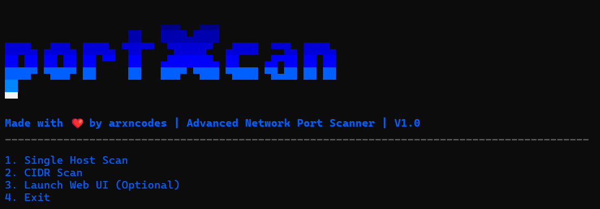

# PortXcan

## Overview
PortXcan is a versatile network scanning tool designed to help users identify open ports and services running on remote hosts. It is built with Python and utilizes asynchronous programming for efficient scanning.

## Features
- **Asynchronous Scanning**: Leverages Python's `asyncio` for fast and efficient network scanning.
- **User-Friendly CLI**: Provides a command-line interface for easy interaction.
- **JSON and CSV Reporting**: Generates detailed reports in JSON and CSV formats for further analysis.

## Installation
To install PortXcan, clone the repository and install the required dependencies:

```bash
git clone https://github.com/arxncodes/PortXcan.git
cd PortXcan
pip install -r requirements.txt
```

## Usage
Run the application using the following command:

```bash
python main.py
```

## CLI Menu Screenshot

Below is a screenshot of the command-line interface (CLI) menu for PortXcan:



## Contributing
Contributions are welcome! Please submit a pull request or open an issue for any suggestions or improvements.

## License
This project is licensed under the MIT License. See the [LICENSE](LICENSE) file for details.

## Contact
For any inquiries, please contact [aryan](www.linkedin.com/in/arxncodes).
